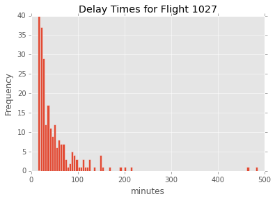
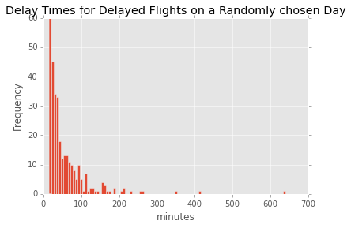
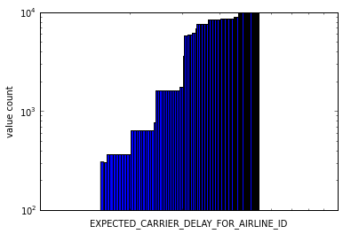
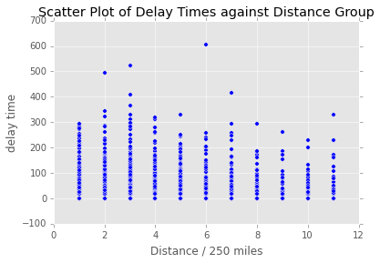
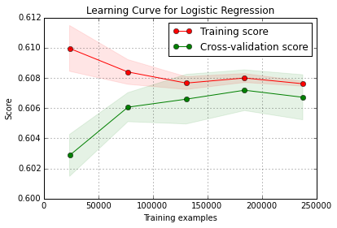

                                          David B. Goldberg
# Predicting Future Airline Delays Using Bureau of Transportation Statistics Historical Flight Data
## Introduction

I was interested in in using the airline dataset to build a system to predict whether or not a flight will be delayed and by how much. 

There were two main challenges that I encountered in this exercise.  First, the dataset was very imbalanced.
Only about 10% of flights are delayed.  2% are cancelled and about 0.2 % are diverted. I decided to drop cancelled flights and diverted flights from the dataset, because they account for a very small amount of the data but a very high proportion of the missing values.  

The second and much more significant challenge is that flight delay times are simply not linear with the variables that I had engineered.  While flight delay times no doubt vary with weather patterns, I decided not to include weather data in my model, because one would not know the weather at the time of a flight ahead of time and historical weather *predictions* are hard to come by.

While I was able to achieve an f1 score of .62 for identifying delayed flights using an SVM with an RBF kernel, I was never able to get above R^2 of 0.1 in the regressions that I ran to predict delay times.  The reason for the difficulty in both regression and classification is that for every value that I was regressing against, the median delay time while holding any of my categorical or time series values constant was 0.




Not only did this pattern persist as I held all of my categorical variables constant, but also as I looked at the  average delay time for each of them across all values.
I plot the following graph of average delay times for each carrier on a log log plot because a straight line on a log log plot often indicates scale-free network effects.



I got a similar graph for all of my categorical values.  I believe the reason for these pareto grahs is that delays propagate through a network.  In essence, the propagation of delays through networks and airlines follows a fractal pattern much like the propagation of [forest fires](https://en.wikipedia.org/wiki/Forest-fire_model) or [avalanches in a sandpile](http://prl.aps.org/abstract/PRL/v59/i4/p381_1).  I did not compute the fractal dimension of delay propagation or obtain the spectral density of delay times, though both might have been helpful and interesting.

the only non-categorical value that I had on hand was 'Flight Distance', which as the plot below will demonstrate, had almost no correlation with delay time.




# Getting The Data

`scrape.py` uses a Selenium browser to automatically fill out the form of the Bureau of Transportation Statisitics website.  It correctly downloads every 1-month chunk of data for the past 3 years.  It then watches for those files to download and then concatenates them into a pandas dataframe that it caches in a designated working directory.  I found it necessary to write this script because downloading the files and transferring them manually was time-consuming and error-prone.  This script greatly sped up my research and I am very proud of it.

# Data Cleaning and Feature Engineering

As mentioned above, I decided to drop cancelled and diverted flights.  In the dataset, the total delay time is distributed by reason for delay (i.e. security, weather). These values are left nan for flights that were not delayed.  In `clean.py`, the nan values are filled in.  Later, in `feature_engineering.py`, the `DELAYED` boolean is set to True for any flight above a given threshold--in this case 30 mintues.  The `TOTAL_DELAY` sum across all delay fields is also set here.

The following variables had dummy variables added to the dataframe for every value that made up a certain cumulative percentage of the dataset: 

UNIQUE_CARRIER, 
ORIGIN_AIRPORT_ID, 
DEST_AIRPORT_ID, 
FL_NUM,
TAIL_NUM, 
QUARTER.  

For example, the 8 most populous `UNIQUE_CARRIERS` make up 80 percent of the data, so dummy variables were made only for those carriers.

I played with a wide range of thresholds for each categorical value, but note that there were about 5000 unique Flight numbers in the 3e6 flight dataset that I was sampling from, which was extremely memory intensive.  Including those categorical variables had almost no effect on the outcome of my model, because flight number is highly coupled with origin and destination airports.  I ultimately decided to drop these categorical values all together from the model.

# Machine Learning

First, I performed principal componenent analysis and transforming my dataset into the first n components to account for 90% of the variance in my dataset.  This is extremely important because I had an enormous dataset (1e6 x 2500) with mostly sparse and highly correlated data.

I attempted linear regression on the principal components and I tried random forest and extra trees regression on the raw dataset.  I was not able to get an accuracy score (R^2) above 0.1 for any of these methods.  

I also attempted both logistic regression and SVM.  With both classifiers, I was only able to attain an f1 score of 0.60 +/- 0.04 on a testing set containing data from 2015 (training data is from 2013 and 2014.

The training scores and cross validation scores in my learning curve approach very close to one another, indicating that I would be in little danger of overfitting if I were to engineer additonal features.



# Conclusion

I was not able to devise a system to accurately predict delay times or even recognize flights that were likely to be delayed very accurately.  However, I was able to get some insight into the dynamics of flight delays.  I believe the reason that I was able to consistently predict at least a small portion of delayed flights indicates that there are some flights that are consistently more prone to delays (perhaps due to weather conditions in an endpoint or operations issues with an airline).  However, the magnitude of a delay is very noisy and I think likely due to network propagation effects.


```python

```
